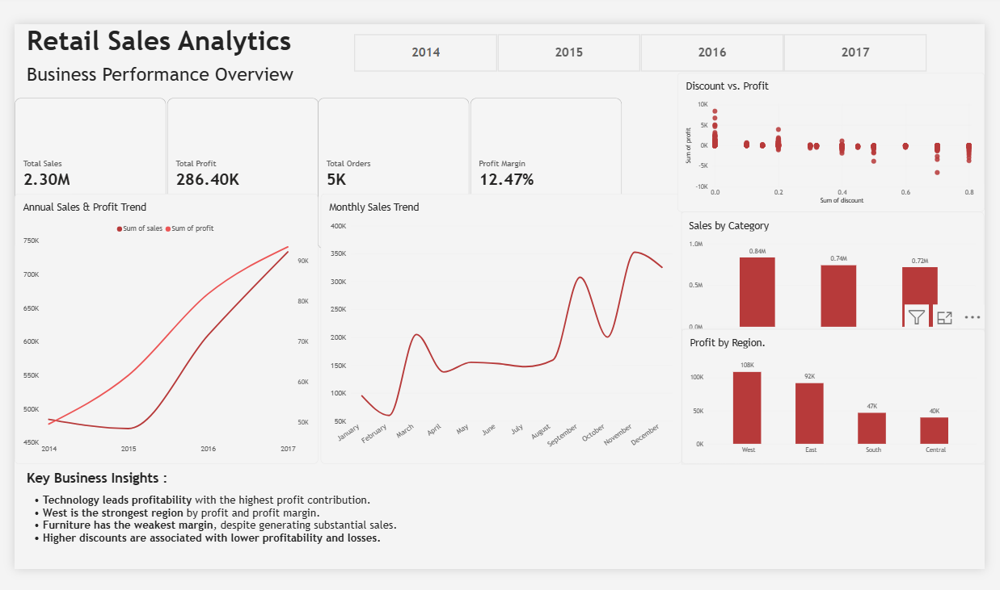

# 📊 Retail Sales Analytics

A retail sales analytics project analyzing sales performance, profitability, customers, products, regions, and discount impact using **SQL (MySQL), Excel, and Power BI**.

This project follows an end-to-end data analyst workflow: data validation → SQL business analysis → advanced SQL analysis → Excel exploratory analysis → Power BI dashboard → business insights and recommendations.

---

## 📊 Table of Contents

- [Project Overview](#-project-overview)
- [Business Objectives](#-business-objectives)
- [Tools & Technologies](#️-tools--technologies)
- [Dataset](#-dataset)
- [Data Quality Checks](#-data-quality-checks)
- [Key Business Metrics](#-key-business-metrics)
- [Power BI Dashboard](#-power-bi-dashboard)
- [Key Business Insights](#-key-business-insights)
- [SQL Analysis](#-sql-analysis)
- [Excel Analysis](#-excel-analysis)
- [Business Recommendations](#-business-recommendations)
- [Project Structure](#-project-structure)
- [Author](#-author)

---

## 📌 Project Overview

Retail businesses need to understand not just how much they sell, but where profitability actually comes from — which products, regions, and customer segments drive margin, and how discounting affects it.

This project analyzes a multi-year retail sales dataset (2014–2017) to answer practical business questions:

- Overall sales and profit performance
- Year-over-year growth
- Category and sub-category performance
- Regional profitability
- Customer purchasing behavior and profitability
- Product performance (top and bottom performers)
- Discount vs. profitability relationships
- Monthly and yearly sales trends

---

## 🎯 Business Objectives

1. Measure overall sales, profit, orders, and profit margin.
2. Identify the most and least profitable product categories and regions.
3. Analyze yearly and monthly sales and profit trends.
4. Evaluate the relationship between discounts and profitability.
5. Analyze customer purchasing behavior and identify top/loss-making customers.
6. Translate analytical findings into actionable business recommendations.

---

## 🛠️ Tools & Technologies

| Tool | Purpose |
|---|---|
| **MySQL / SQL** | Data validation, business analysis, and advanced (window function) analysis |
| **Microsoft Excel** | Exploratory analysis, pivot tables |
| **Power BI** | Interactive executive dashboard and visualization |
| **Git / GitHub** | Version control and project documentation |

---

## 📁 Dataset

The project uses a retail Superstore-style transactional dataset covering **January 2014 – December 2017**, with fields including:

Order ID, Order Date, Ship Date, Ship Mode, Customer ID, Customer Name, Segment, Country, City, State, Postal Code, Region, Product ID, Category, Sub-Category, Product Name, Sales, Quantity, Discount, Profit.

| Metric | Value |
|---|---:|
| Total Records | `[run 02_data_cleaning.sql summary query]` |
| Total Customers | `[run 02_data_cleaning.sql summary query]` |
| Total Orders | **5,009** |
| Units Sold | `[run 02_data_cleaning.sql summary query]` |
| Analysis Period | **Jan 2014 – Dec 2017** |

> The blanks above come straight from the "DATA QUALITY SUMMARY" query at the bottom of `02_data_cleaning.sql` — run it once in MySQL and paste in the real values.

---

## 🔍 Data Quality Checks

Before analysis, the dataset was validated in `02_data_cleaning.sql` for:

- Total row count and Row ID uniqueness (duplicate check)
- Missing/NULL values across key fields
- Invalid numeric values (negative sales, zero/negative quantity, out-of-range discount)
- Order date range validation
- Category, Region, Segment, and Ship Mode consistency

---

## 📈 Key Business Metrics

*(from the Power BI dashboard)*

| Metric | Result |
|---|---:|
| Total Sales | **$2.30M** |
| Total Profit | **$286.40K** |
| Total Orders | **~5,009** |
| Profit Margin | **12.47%** |
| Analysis Period | **2014–2017** |

---

# 📊 Power BI Dashboard

The Power BI dashboard provides an executive-level view of retail sales performance and profitability.

### Dashboard Features

- Total Sales, Total Profit, Total Orders, Profit Margin KPI cards
- Annual Sales & Profit Trend
- Monthly Sales Trend
- Sales by Category
- Profit by Region
- Year filtering (2014–2017)
- Key Business Insights panel

### Dashboard Preview



---

# 💡 Key Business Insights

1. **Technology leads profitability** with the highest profit contribution among categories.
2. **West is the strongest region** by both profit and profit margin.
3. **Furniture has the weakest margin** despite generating substantial sales — strong revenue does not guarantee strong profitability.
4. **Higher discount levels are associated with lower profitability**, with the SQL discount-band analysis (`03_business_analysis.sql`) showing margins deteriorating — and turning loss-making — at higher discount tiers. This is an observed association in the data, not a claim of direct causation.

---

# 🧮 SQL Analysis

SQL work is organized by workflow stage:

### `01_database_setup.sql`
Creates the MySQL database and the `retail_sales` table structure.

### `02_data_cleaning.sql`
Data validation and quality checks — row counts, NULL checks, duplicate Row IDs, numeric range validation, category/region/segment/ship-mode consistency.

### `03_business_analysis.sql`
Core business analysis, including:
- Overall KPIs and profit margin
- Sales & profit by year, month, category, sub-category, region, segment
- Profitability by discount level
- Top/bottom 10 products by profit
- Top 10 customers by sales and by profit
- Average order value (overall, by segment, by region)
- Repeat vs. one-time customer analysis
- Loss-making customer identification
- Shipping mode and state-level performance

### `04_advanced_analysis.sql`
Advanced SQL using CTEs, window functions, and ranking:
- Top 3 most profitable products per category (`RANK()`)
- Top 5 products by sales per category
- Monthly sales with running total (`SUM() OVER`)
- Year-over-year sales growth, overall and by category (`LAG()`)
- Category profit contribution % of total
- Top 5 profitable customers per segment
- Products with repeated loss-making sales
- High-sales, low-margin product identification
- Yearly profit running total
- Customer sales contribution %
- Top customers by profit per order

### `05_data_import.sql`
Reproducible CSV → MySQL import process (`LOAD DATA INFILE`), including date parsing.

---

# 📊 Excel Analysis

Excel was used for exploratory analysis and initial business validation, including pivot tables covering category, regional, yearly, and monthly performance, and profit margin calculations.

Workbook: `excel/Retail_Sales_Analysis.xlsx`

---

# 💼 Business Recommendations

1. **Review Furniture profitability** — investigate pricing, product mix, and discounting within the category.
2. **Optimize discount strategy** — use the discount-band SQL analysis to set thresholds that protect margin rather than discounting broadly.
3. **Continue investing in Technology** — it shows the strongest profitability and should remain a growth priority.
4. **Investigate underperforming regions** — compare product mix and discount exposure between West (top performer) and lower-margin regions.
5. **Monitor profit alongside revenue** — several categories/products generate high sales but weak or negative margin; use the top/bottom product and loss-making customer queries regularly, not just at report time.

---

# 📂 Project Structure

```text
01-Retail-Sales-Analytics/
│
├── data/
│   └── raw/
│       └── superstore.csv
│
├── excel/
│   └── Retail_Sales_Analysis.xlsx
│
├── powerbi/
│   └── Retail_Sales_Analytics.pbix
│
├── screenshots/
│   └── dashboard.png
│
├── sql/
│   ├── 01_database_setup.sql
│   ├── 02_data_cleaning.sql
│   ├── 03_business_analysis.sql
│   ├── 04_advanced_analysis.sql
│   └── 05_data_import.sql
│
└── README.md
```

---

# 🔄 Project Workflow

```text
Raw Data
    ↓
Data Validation (SQL)
    ↓
Excel Exploratory Analysis
    ↓
MySQL Data Import
    ↓
SQL Business Analysis
    ↓
Advanced SQL Analysis (CTEs, Window Functions)
    ↓
Power BI Dashboard
    ↓
Business Insights
    ↓
Business Recommendations
```

---

# 👤 Author

**Syed Khush**
Bachelor of Engineering – Computer Science
**Skills:** SQL | Excel | Power BI | Data Analytics

[GitHub Profile](https://github.com/syedkhush31)

---

**Project:** Retail Sales Analytics
**Tools:** MySQL | SQL | Excel | Power BI | GitHub
